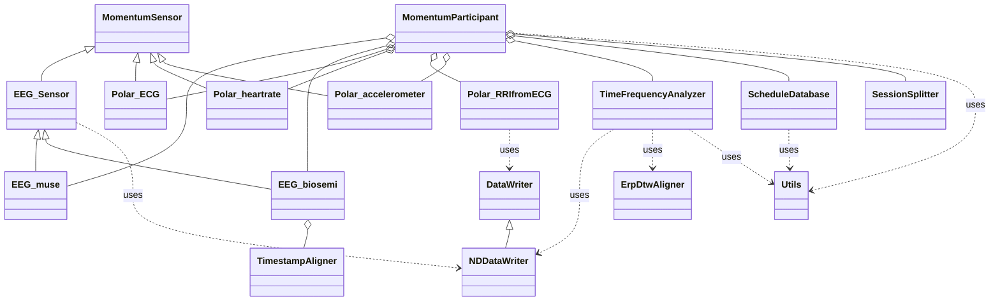

# Object‑Oriented Multimodal Pipeline (ECG→RRI, Accelerometer, EEG + Time–Frequency)

## Table of contents

1. [Quick start](#quick-start)
2. [Repository layout](#repository-layout)
3. [Data locations & naming](#data-locations--naming)
4. [Preprocessing per sensor](#preprocessing-per-sensor)
5. [Time–frequency analysis](#time–frequency-analysis)
6. [Merging across participants](#merging-across-participants)
7. [Outputs: directory structure, & metadata](#outputs-directory-structure--metadata)
8. [Object architecture](#object-architecture)
---

## Quick start

1. **Run a single participant** locally in MATLAB:

   ```matlab
   % from /ObjectOriented/
   participant = runMomentumParticipantAnalysis(participantId,rawDataDir,preprocessedEEGDir);
   
   ```
where:

`participantId` is a string with the participant id (e.g. `"123456"`)

`rawDataDir` has a directory with the `participantId`'s raw data (see [Data locations & naming](#data-locations--naming)).

`preprocessedEEGDir` has a directory with `participantId`'s preprocessed data (see [Data locations & naming](#data-locations--naming)).

2. **Submit all participants on SLURM**:

   ```bash
   # from /ObjectOriented/
   sbatch bash/runParticipantAnalysisJobs.sh
   ```

3. **Find outputs** in `preprocessedEEGDir/DataProcessed` (see [Outputs](#outputs-file-types-structure--metadata)).

---

## Repository layout

```text
ObjectOriented/
    ├── README.md                                   # this file
    ├── MATLAB/                               
    │   ├── runMomentumParticipantAnalysis.m        # MATLAB entry point (single participant)
    │   ├── mergeParticipantFiles.m                 # MATLAB entry point for merging participant data
    │   ├── pipeline/
    │   │   ├── MomentumParticipant.m               # orchestrates run for one participant
    │   │   ├── MomentumExperiment.m                # general functions for managing directories
    │   │   └── MomentumParticipantMerger.m         # merges outputs across participants
    │   ├── sensors/
    │   │   ├── EEG_biosemi.m                       # EEG Biosemi preprocessing 
    │   │   ├── EEG_muse.m                          # EEG Muse preprocessing
    │   │   ├── EEGSensor.m                         # Base class for all EEG sensors 
    │   │   ├── MomentumSensor.m                    # Base class for all sensors
    │   │   ├── Polar_accelerometer.m               # Accelerometer preprocessing
    │   │   ├── Polar_ECG.m                         # ECG preprocessing
    │   │   ├── Polar_heartrate.m                   # Streamed heartrate preprocessing
    │   │   └── Polar_RRIfromECG.m                  # ECG→RRI preprocessing
    │   ├── utils/                 
    │   │   ├── DataWriter.m                        # Base class for NDDataWriter
    │   │   ├── ErpDtwAligner.m                     # Dynamic Time Warper tool 
    │   │   ├── ndarray2table.m                     # Converts nd array to 2D table
    │   │   ├── NDDATAWriter.m                      # Manages how preprocessed data will be organized and saved 
    │   │   ├── RespiratoryRateEstimator.m          # Tool for estimating respiratory rate from accelerometer data (WIP)
    │   │   ├── ScheduleDatabase.m                  # Manages the participant's behavioral file 
    │   │   ├── SessionSplitter.m                   # Splits the data into sessions
    │   │   ├── TFPlotter.m                         # Plotting tool
    │   │   ├── TimeFrequencyAnalyzer.m             # Manages the time frequency analysis for EEG    
    │   │   ├── TimestampAligner.m                  # Takes care of the alignment of EEG Biosemi in validation
    │   │   └── Utils.m                             # Generic functions (database manipulation, datetime converter)
    └── bash/                 
        ├── runParticipantAnalysisJobs.sh           # slurm script to preprocess participants
        └── mergeParticipantFiles.sh                # slurm script to merge all preprocessed participants files
```

---

## Data locations & naming

* **Raw data root (read‑only):** `rawDataDir` 
```text
rawDataDir/
    ├── {participantId}/                                            # Main participant directory
    │   ├── physio/                                                 # Directory containing all raw data
    │   │     ├── {participantId}_physio_{YYYYMMDDHHmmSS}.db        # Raw database file  
    │   │     └── ...
    │   └── schedule/                                               # behavioral directory
    │         └── {...}_{participantId}_schedule.db                 # Behavioral database file 
    └── ...
```
* **Preprocessed data (read‑only):** `preprocessedEEGDir`
```text
preprocessedEEGDir/             
    └── Data_Processed/                                             # Preprocessed data directory
        ├── subject_{participantId}/                                # Main participant directory
        │   └── {participantId}_EEG1.mat                            # Preprocessed EEG
        └── ...
```

## Preprocessing per sensor

### EEG

* **Input:** MUSE or Biosemi EEG 
* **Steps:** See [EEG_biosemi.preprocessData()](MATLAB/sensors/EEG_biosemi.m) and [EEG_muse.preprocessData()](MATLAB/sensors/EEG_muse.m) 

### ECG → RRI

* **Input:** Polar H10 ECG
* **Steps:** See [Polar_RRIfromECG.preprocessData()](MATLAB/sensors/Polar_RRIfromECG.m)

### Accelerometer

* **Input:** Polar H10 tri‑axial accelerometer data
* **Steps:** See [Polar_accelerometer.preprocessData()](MATLAB/sensors/Polar_accelerometer.m)

---

## Time–frequency analysis

* **Object:** `TimeFrequencyAnalyzer`
* **Input:** preprocessed EEG as MomentumSensor object 
* **Method(s):** `tfa.getTF()`, `tfa.getInduced()`, `tfa.referenceEEG()`, `tfa.trimTF()`, `tfa.saveTF()`and `tfa.saveInduced()`.
* **Params:** See  [TimeFrequencyAnalyzer](MATLAB/utils/TimeFrequencyAnalyzer.m).

**Example call**

```matlab
tfa = TimeFrequencyAnalyzer(EEGObject);
tfa.getTF();
tfa.saveTF(params.tfa);
```
---

## Merging across participants

* **Object:** `MomentumParticipantMerger`
* **Purpose:** Merge the individual participant data into multiple files

**Example**

```matlab
merger = MomentumParticipantMerger(participantsDir);
merger.merge(eventName, sectionsToMerge,freqLabel,binningMode, timeBinIdx,blocksBinIdx,extension);
```

---

## Outputs: directory structure, & metadata


```text
/preprocessedEEGDir/DataProcessed
├── AlignedEvent/
│   ├── EEG
│   │   └── {eventName}/
│   │       ├── ByParticipant/
│   │       │   └──{participantId}/
│   │       │       ├──{participantId}_{eventName}_{section}_{binningMode}_{timeBinIdx}.{extension}
│   │       │       └── ...
│   │       └── ByTimeBin/
│   │           ├──{eventName}_{section}_{binningMode}_{timeBinIdx}.{extension}
│   │           └── ...
│   │   
│   ├── RRI
│   │   └── {eventName}/
│   │       ├── ByParticipant/
│   │       │   └──{participantId}/
│   │       │       ├──{participantId}_{eventName}.{extension}
│   │       │       └── ...
│   │       └── ByTimeBin/
│   │           └──{eventName}.{extension}
│   │           └── ...
│   ├── TF
│   │   └── {eventName}/
│   │       ├── ByParticipant/
│   │       │   └──{participantId}/
│   │       │       ├──{participantId}_{eventName}_{section}_freqBin_{frequencyBinIdx }_{binningMode}_{timeBinIdx}.{extension}
│   │       │       └── ...
│   │       └── ByTimeBin/
│   │           ├──{eventName}_{section}_{binningMode}_{timeBinIdx}.{extension}
│   │           └── ...
│   └── ...
└── Validation/
    ├── EEG/
    │   └── {eventName}/
    │       ├── ByParticipant/
    │       │   └──{participantId}/
    │       │       ├── biosemi/
    │       │       │   ├──{participantId}_{eventName}_{biosemiChannel}.{extension}
    │       │       │   └── ...
    │       │       └── muse/
    │       │           ├──{participantId}_{eventName}_front.{extension}
    │       │           └──{participantId}_{eventName}_temp.{extension}
    │       └── ByTimeBin/
    │           ├── biosemi/
    │           │   ├──{eventName}_{biosemiChannel}.{extension}
    │           │   └── ...
    │           └── muse/
    │               ├──{eventName}_front.{extension}
    │               └──{eventName}_temp.{extension}
    └── TF
        └── {eventName}/
            ├── ByParticipant/
            │   └──{participantId}/
            │       ├── biosemi/
            │       │   ├──{participantId}_{eventName}_{biosemiChannel}_freqBin_{frequencyBinIdx}.{extension}
            │       │   └── ...
            │       └── muse/
            │           ├──{participantId}_{eventName}_front_freqBin_{frequencyBinIdx}.{extension}
            │           └──{participantId}_{eventName}_temp_freqBin_{frequencyBinIdx}.{extension}
            └── ByTimeBin/
                ├── biosemi/
                │   ├──{eventName}_{biosemiChannel}_freqBin_{frequencyBinIdx}.{extension}
                │   └── ...
                └── muse/
                    ├──{eventName}_front__freqBin_{frequencyBinIdx}.{extension}
                    └──{eventName}_temp_freqBin_{frequencyBinIdx}.{extension}
```
---
## Object architecture

